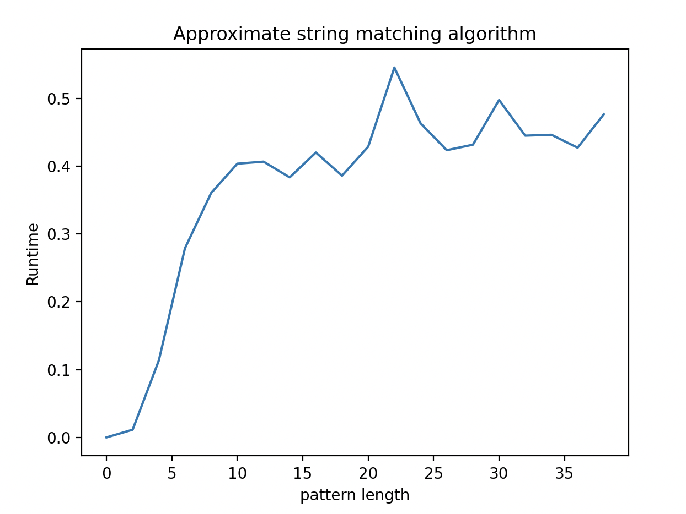
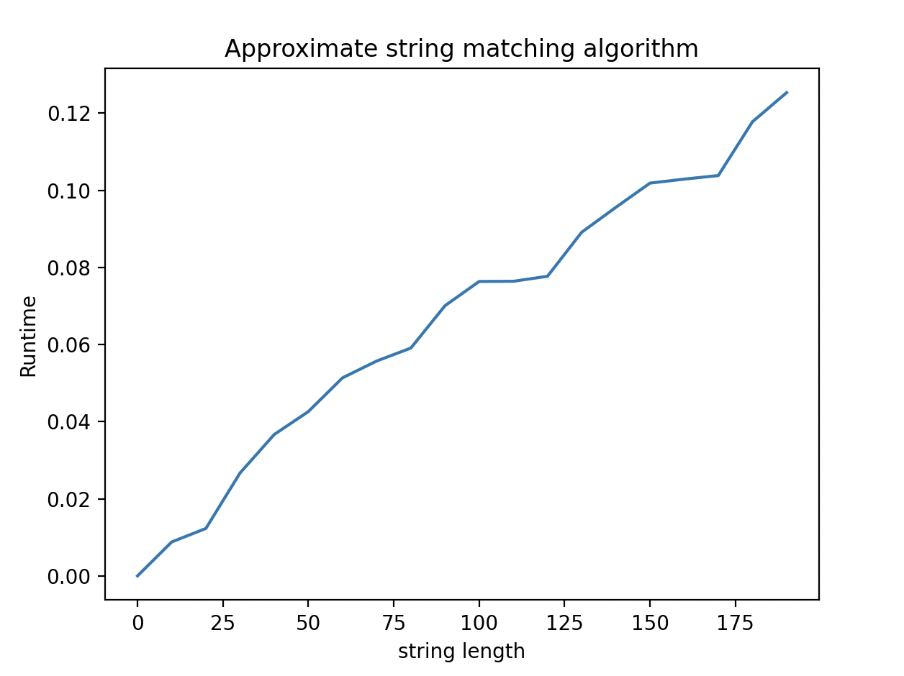

[](https://classroom.github.com/online_ide?assignment_repo_id=9404581&assignment_repo_type=AssignmentRepo)
# Project 5: building your very own readmapper

In this final project, you will write a complete read mapper.

The read mapper should be able to preprocess a reference genome. To avoid preprocessing each time you need to map reads, you should store the preprocessed data structures on disk. Reference genomes come in Simple-FASTA format, as usual, and reads in Simple-FASTQ format, and your tool must write matches to standard out in Simple-SAM.

Your program, which should be named `readmap`, and should take the following options:

* `readmap -p genome.fa` should preprocess the genome
* `readmap -d k genome.fa reads.fq` should do read-mapping for matches within an edit distance .


## Assembly required

If you have made all project and all exercises you will have most of what goes into a readmapper.

1. You implemented the file format parsers in the first week of the class, and you have been using them in the four previous projects.
2. If you map using a suffix tree, you have implemented it in project 2.
3. If you map using Li & Durbin’s algorithm you implemented most of the necessary data structures in projects 3 and 4.

## Batteries not included

You have not implemented approximative matching, so you have to implement that now.

## Testing

You can use the [gsa] Python package for generating test data and running tests. You can clone it from the GitHub repository or use:

```bash
> python3 -m pip install git+https://github.com/birc-gsa/gsa#egg=gsa
```

Amongst other things, the tool can simulate data. If you run, for example

```bash
> gsa simulate genome 23 100000 > genome.fa
```

you will simulate a genome with 23 chromosomes, each of length 100,000.

After that,

```bash
> gsa simulate reads genome.fa 2000 100
```

will simulate 2000 reads of length 100.

If you then do

```bash
> gsa search genome.fa reads.fq approx -e 1 bwt
```

to find all the hits within one edit distance of a read. If you want it faster, preprocess the genome first with

```bash
> gsa preprocess genome.fa approx-bwt
```

You should notice a speed difference; you want to achieve the same with your own preprocessing.

You can use the tool to test your read mapper as well. This requires a spec file that defines how tools should be tested. It can look like this:

```yaml
tools:
  GSA:
    preprocess: "gsa preprocess {genome} approx-bwt"
    map: "gsa search {genome} {reads} -o {outfile} approx -e {e} bwt"
  readmap:
    preprocess: "{root}/readmap -p {genome}"
    map: "{root}/readmap -d {e} {genome} {reads} > {outfile}"

reference-tool: GSA

genomes:
  length: [1000, 5000, 10000]
  chromosomes: 10

reads:
  number: 10
  length: 10
  edits: [0, 1, 2]
```

The `tools` section is a list of tools to run, each with a `preprocess` and a `map` command line. You can have as many as you like. The `reference-tool` selects which tool to consider “correct”; all other tools are compared against its results. Then `genomes` specify the genome length and number of chromosomes. Lists here will add a test for each combination. Similarly, the `reads` specify the reads, their number and length and how many edits the simulation and the readmapping will use.

The variables in `{...}` are used by `gsa` when you specify command lines. `{root}` refers to the directory where the YAML file sits, so if your tool and the YAML file are in the same directory, your tool is at `{root}/readmap`. The `{genome}` and `{reads}` tags are the input files and `{outfile}` the name of the output file. Don’t get inventive with the command line for your tool, though, I also have a test ready to run, and if you do not implement the interface specified above, the test will fail (and that will be your problem and not mine).

If you put this file in `tests.yml`, and you have the tool `readmap`, you can run the test with

```bash
> gsa -v test tests.yaml
```

The read mapper in `gsa` doesn’t output matches with leading or training deletions. We talk about why, and how you avoid it as well, in the exercises. Keep that in mind when you are developing your own tool.

## Evaluation

Once you have implemented the `readmap` program (and tested it to the best of your abilities) fill out the report below, and notify me that your pull request is ready for review.

# Report

## Algorithm

Since the object of this project is to do approximate matching and not exact matching, the solution proposed has necessarily to be different. This algorithm explores the tree of different paths to solution by applying the basic 3 operations: insertion, deletion and substitution, where each operation cost 1 units of edits to make. If the character from the genome and pattern matches the cost is 0. The recursion stops when there has been more edits than the defined limit or when we have found a solution. At each iteration, we apply FM-indexing over the genome using the reversed pattern.

Moreover, and in order to prune the tree, a D-table has been introduced, which calculates an optimistic function of minimum cost necessary to find a solution from each character (from right to left). If at any point there are less edits available that the number indicated by the D-table, we can discard that branch of possibilities, since it is not possible to have a solution there.

## Insights you may have had while implementing the algorithm

While implementing the algorithm we have understood how conceptually each of the basic operations work at the implementation level, and we have been able to deepen our knowledge onto FM-indexing while studying special cases in the debugging stage.

## Problems encountered if any

## Validation

*How did you validate that the algorithm works?*

## Running time

For the suffix array construction runtime refer to the previous project (https://github.com/birc-gsa-2022/project-3-python-illiterate-apes) readme.
For the construction of the BWT, rank_table and firstIndexList refer to the previous project (https://github.com/birc-gsa-2022/project-4-python-illiterate-apes) readme.

Approximate matching with fm-index and D-Table

With varying pattern length


With varying string length
